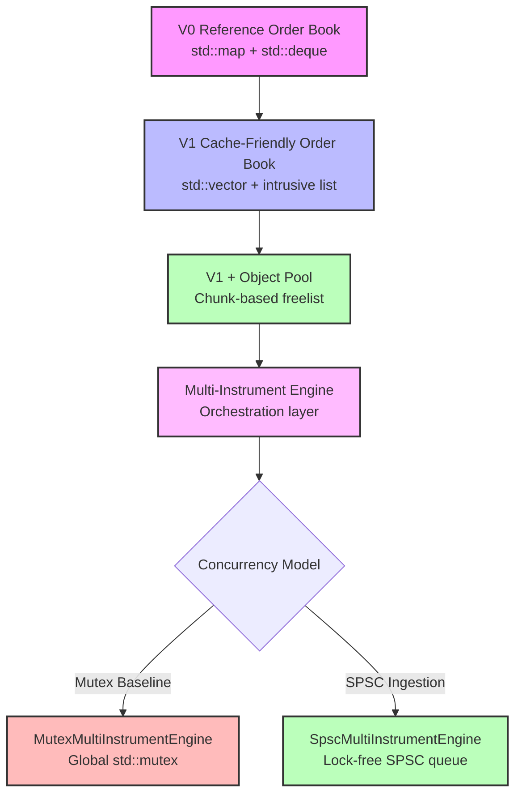
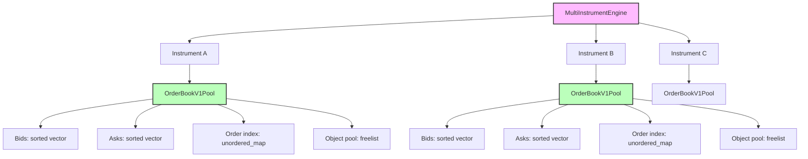
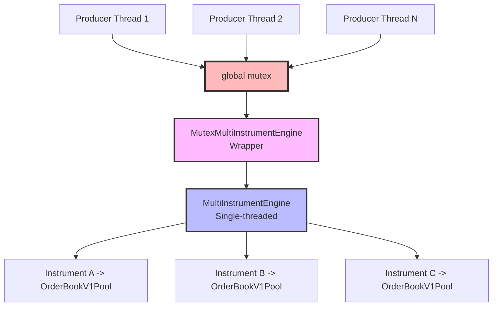
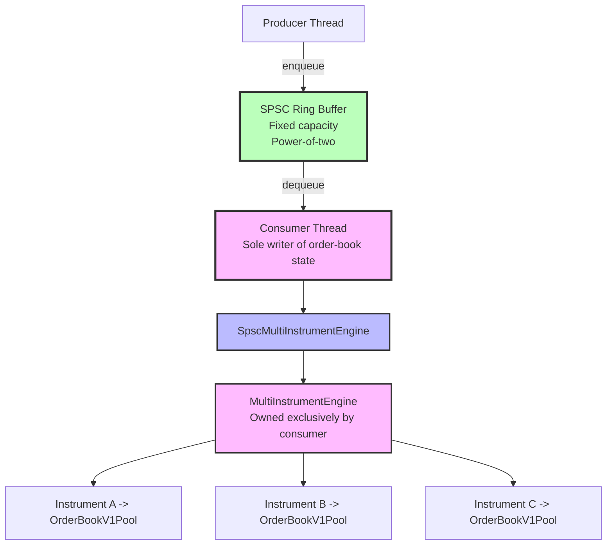
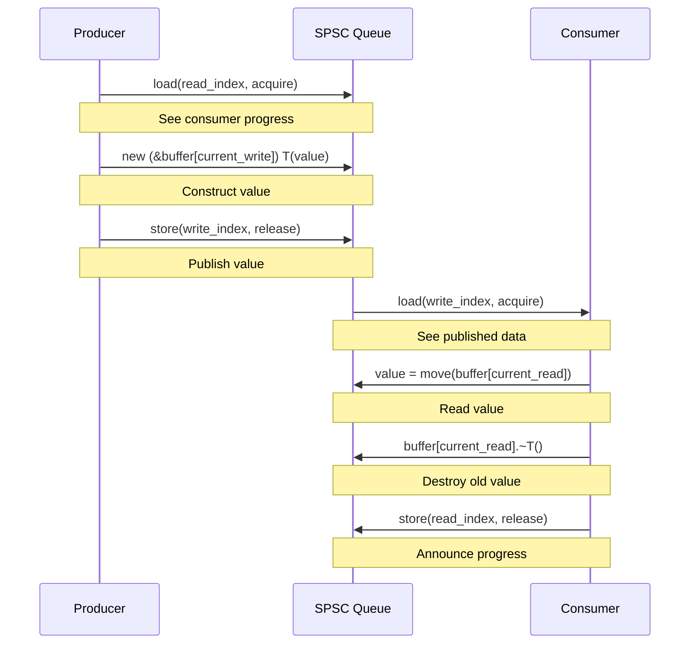
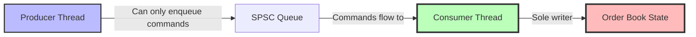
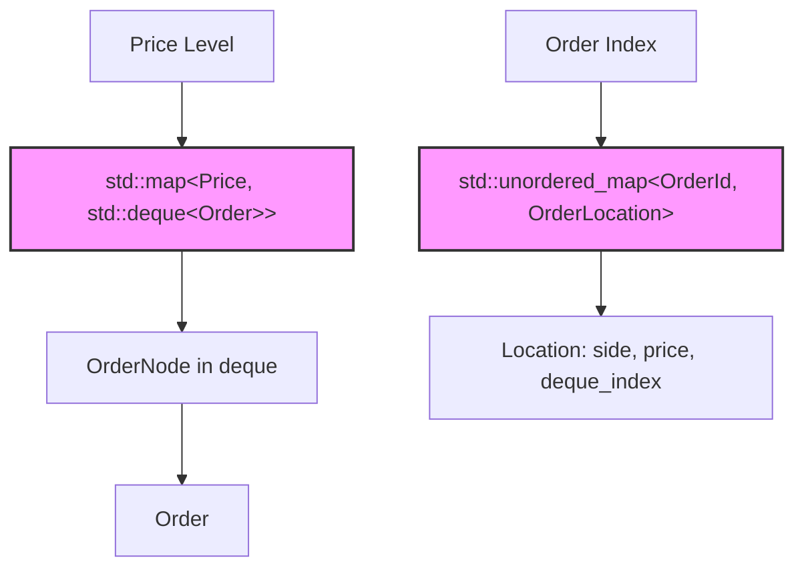
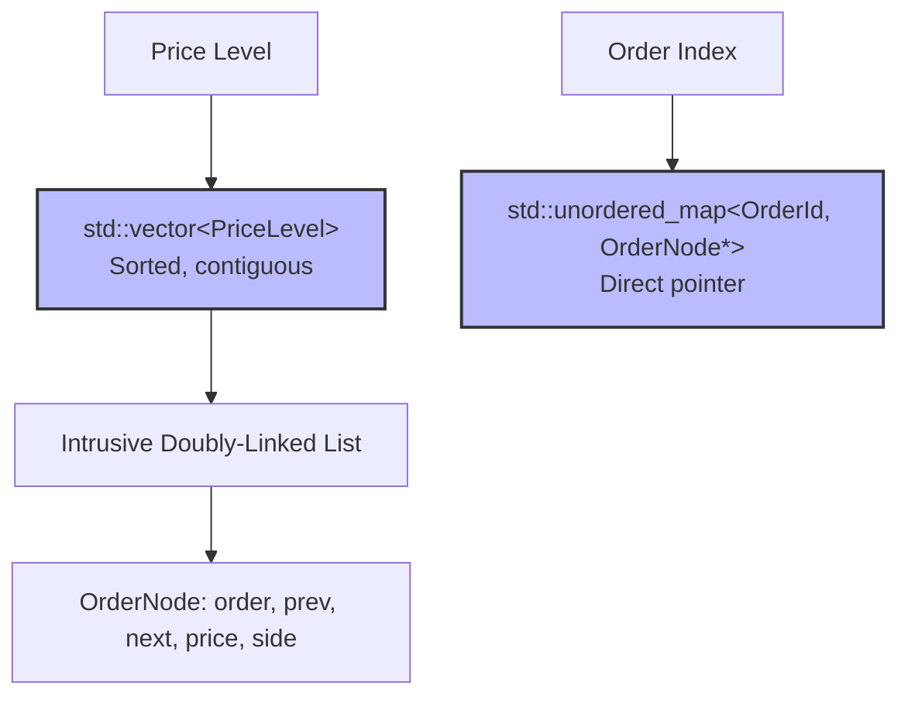
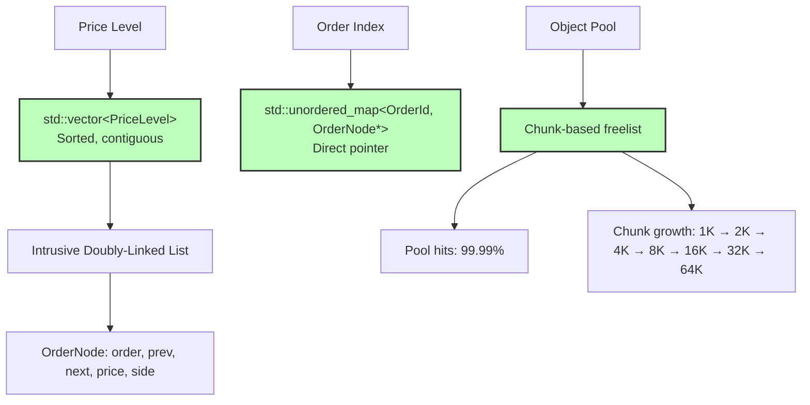

# Architecture Diagram

## System Evolution

## Multi-Instrument Architecture

## Mutex Concurrency Baseline

## SPSC Ingestion Architecture

## SPSC Queue Memory Ordering

## Single-Writer Invariant

The SPSC architecture enforces a critical invariant:

**ONLY the matching-engine consumer thread directly mutates order-book state.**

This is enforced by:
- API design: `SpscMultiInstrumentEngine` only exposes enqueue methods
- No direct access: Underlying `MultiInstrumentEngine` is private (except test-only)
- Clear documentation: Ownership boundary is explicit

## Order Book Data Structure Evolution

### V0 (Baseline)

### V1 (Cache-Friendly)

### V1 + Object Pool

